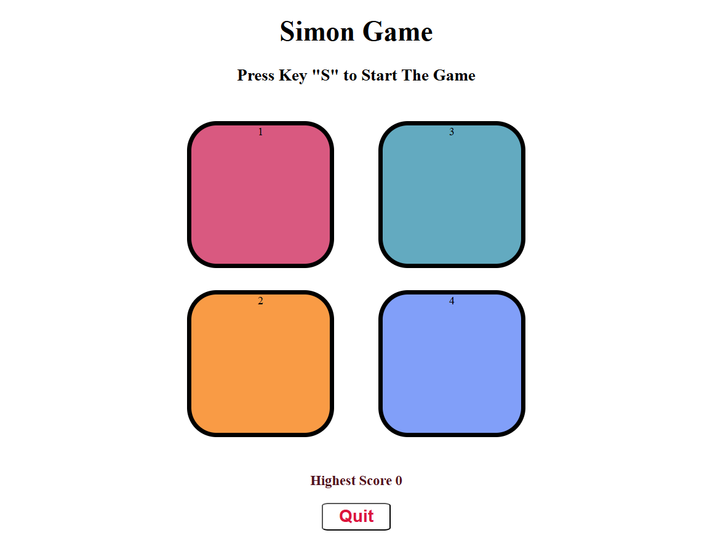

# Simon Says Game 🎮

A browser-based memory game inspired by the classic **Simon Says** toy — built with **vanilla HTML, CSS, and JavaScript**. No libraries, no frameworks, just pure logic.



---

## 🚀 Live Demo

> https://yash762816.github.io/Simon-Says-Game/
---

## 🎯 How to Play

1. Press **"S"** on your keyboard to start the game
2. Watch the button that **flashes white** — memorize the sequence
3. Click the buttons in the **same order**
4. Each level adds **one more step** to the sequence
5. Wrong click? **Game Over** — the screen flashes red!
6. Press **"S"** again to restart and beat your highest score
7. Click **Quit** anytime to end the game

---

## 💡 What Makes This Special

This project goes beyond static UI — it implements a **real game engine in vanilla JS**: sequence generation, user input tracking, answer validation, level progression, and score persistence — all without a single external library.

---

## ✨ Features

- **Keyboard trigger** — game starts on `S` keypress using `document.addEventListener("keypress")`
- **Auto level progression** — each correct round adds a new random color to the sequence
- **Real-time answer checking** — every button click is validated against the game sequence index-by-index
- **Flash animations** — CSS class toggling with `setTimeout` creates game flash (white) and user flash (olive green) effects
- **Game Over screen** — body flashes red for 300ms, score is displayed, game resets automatically
- **Highest score tracker** — persists across rounds in the same session; updates only when beaten
- **Quit button** — ends the game at any point and triggers the Game Over state
- **4-color button grid** — responsive two-line layout using flexbox

---

## 🗂️ Project Structure

```
simon-game/
├── index.html       # Game layout: buttons, headings, quit button
├── simon.css        # Styling, button colors, flash classes
└── simon.js         # Complete game logic
```

---

## 🛠️ Tech Stack

| Technology | Purpose |
|---|---|
| HTML5 | Game structure and button layout |
| CSS3 | Button styling, flash animations, hover effects |
| JavaScript (Vanilla) | Game engine — sequences, validation, scoring |

**Zero dependencies. Zero frameworks. Pure JavaScript.**

---

## 🧠 Key JavaScript Concepts Used

| Concept | Where It's Applied |
|---|---|
| `document.addEventListener` | Listens for `S` keypress to start the game |
| `Math.random()` + `Math.floor()` | Picks a random color each level |
| Arrays (`gameSeq`, `userSeq`) | Store and compare game vs user sequences |
| `classList.add` / `classList.remove` | Trigger flash animations via CSS classes |
| `setTimeout` | Controls flash duration (350ms) and level-up delay (1000ms) |
| `querySelectorAll` + `for...of` loop | Attaches click listeners to all 4 buttons |
| `this` keyword | Inside `btnPress()`, refers to the clicked button element |
| `getAttribute("id")` | Gets the color name from the clicked button |
| `innerHTML` | Updates game messages dynamically |
| Conditional logic | Checks answer index-by-index, handles win/loss |

---

## 📖 How the Game Engine Works

**Sequence Generation (`levelUp`):**
Every round, a random index (0–3) picks one of the 4 colors. That color is pushed to `gameSeq[]`. The corresponding button flashes white for 350ms. The user sequence is reset to empty.

**Answer Validation (`checkAns`):**
Every button click pushes the color to `userSeq[]` and immediately calls `checkAns` with the current index. It checks `userSeq[i] == gameSeq[i]` — if correct AND it's the last element of the level, it calls `levelUp` after 1 second. If wrong, it triggers `outOfGame`.

**Game Over (`outOfGame`):**
Flashes the body red for 300ms, compares current score to `highest_scr`, updates if beaten, resets all arrays and flags, and changes the heading to prompt restart.

```
Game Start (S key)
      ↓
  levelUp() → random color added to gameSeq[] → button flashes
      ↓
  User clicks buttons → userSeq[] fills up
      ↓
  checkAns() on every click
      ↓
  ✅ All correct → setTimeout → levelUp() again
  ❌ Wrong → outOfGame() → reset everything
```

---

## 🎨 Key CSS Details

- **`.flash`** — turns button `white` for 350ms (game's turn)
- **`.userflash`** — turns button `darkolivegreen` for 350ms (user's turn)
- Two visually distinct flash colors make it clear whose turn it is
- Buttons are large (`12.5rem × 12.5rem`) for easy clicking
- `border-radius: 20%` gives a soft rounded-square shape matching the classic Simon toy

---

## 🚀 Getting Started

```bash
git clone https://github.com/Yash762816/Simon-Says-Game.git
cd simon-game
# Open index.html in your browser — no setup needed
```

